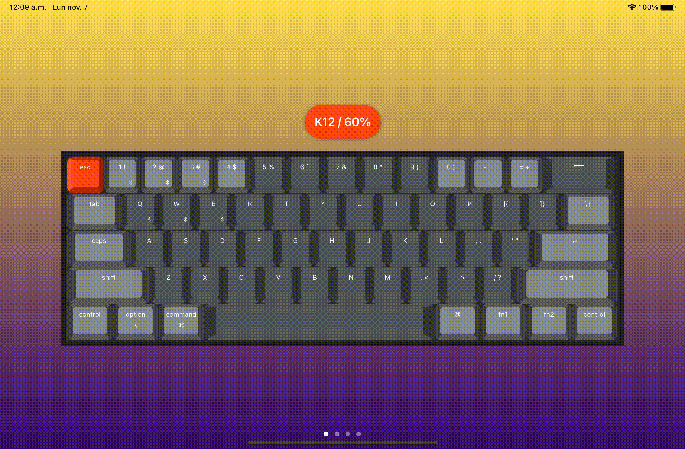

# Keychron

Keychrons modeled using Swift & SwiftUI.

Currently supported models:

* K12 - [Layout and Keycap Size Chart](https://www.keychron.com/pages/keychron-k12-keyboard-keycap-layout-and-keycap-size-chart)
* K6 - [Layout and Keycap Size Chart](https://www.keychron.com/pages/keychron-k6-keyboard-keycaps-layout-and-keycap-size-hd-picture)
* K2 - [Layout and Keycap Size Chart](https://www.keychron.com/pages/keychron-k2-keyboard-keycaps-layout-and-keycap-size-hd-picture)
* K8 - [Layout and Keycap Size Chart](https://www.keychron.com/pages/keychron-k8-keyboard-keycaps-layout-and-keycap-size-hd-picture)

Icons and symbols obtained from Material Symbols. [Link](https://fonts.google.com/icons)

