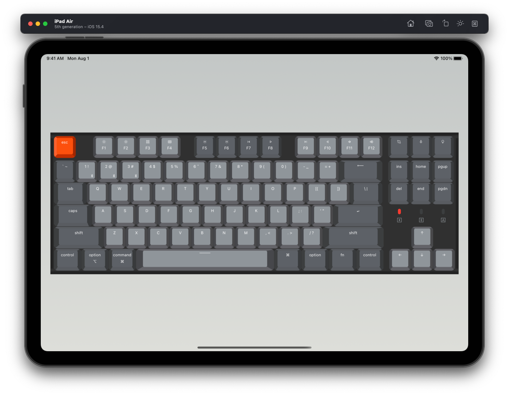

# Keychron

Keychron K8 keyboard model using Swift & SwiftUI.

* Keycaps size and layout using the oficcial keyboard site. [Link](https://www.keychron.com/pages/keychron-k8-keyboard-keycaps-layout-and-keycap-size-hd-picture)
* Icons and symbols obtained from Material Symbols. [Link](https://fonts.google.com/icons)

More keyboards and layouts and interactions coming soon!

